# Motorcycle Wheel Simulator

Contributior: Paul McIntosh

The is a wheel simulator is to enable bench testing wheel hall effect sensors and their input to the motorcycle/scooter system.

The basic concept is to simulate a rotating magnet that would sit on a wheel and drives a hall effect sensor. Why is this useful? The signal from a hall effect (or reed switch) can be noisy or not fit for purpose, trying to debug problems on a motorcycle/scooter while riding, takes insane circus skills and although fun, may put your electronic test equipment in danger :)

This simulator solves the problem by providing an adjustable RPM to drive your sensor, so you can develop things like speedometers and other cool things, like power from acceleration.

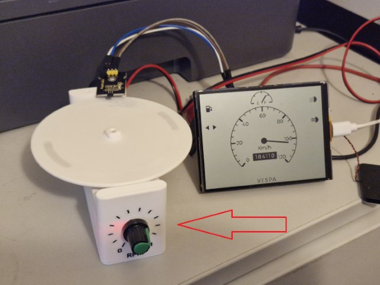

## What is provided

- stl files you can 3d print
- step files you can adjust to your needs

## What you need

The stls work with the following components

- Neodymium Disc Magnet - 6mm x 2mm
- 1000rpm Mini DC N20 geared motor 
- EMSea PWM DC Low Voltage Motor Speed Controller with Control Knob to match above
- Connectors, screws and wire etc

Note: you get what you pay for - lots of cheap stuff will work but may be noisy and buggy

## Considerations

The stls provided can take 4 x magnets, use 2 or 4 to keep the rotor balanced. **Make sure they are inserted with the same N/S orientation so that the hall sensor detects the same magnetic field each time**

With the above you can pick your target RPM based on wheel size and speed e.g. 2 magnets with 1000RPM motor = 2000RPM.

## Construction Images

Steps to construct - assuming 3d printing has completed

1. Attach wiring to components (see parts list above)

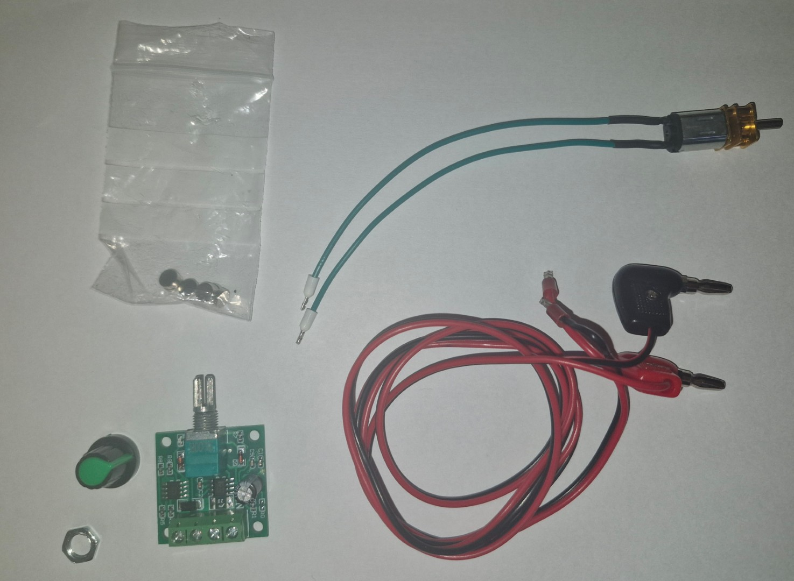

2. Push motor in from the top

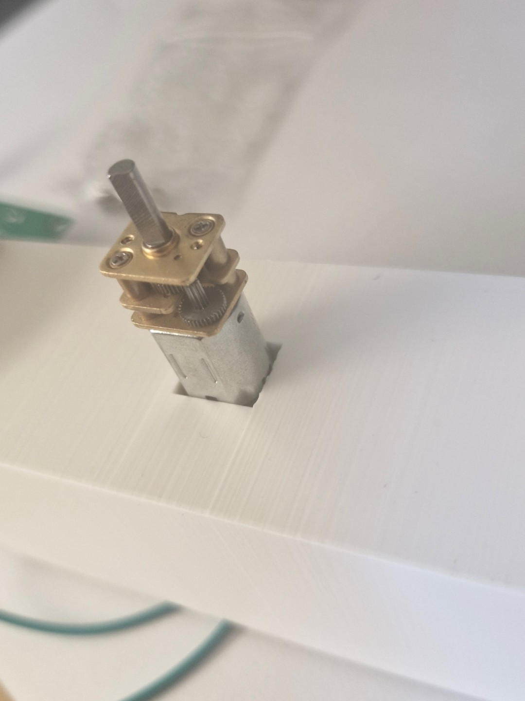
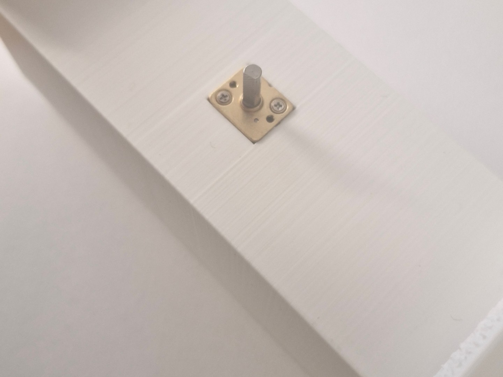

3. Press on adaptor

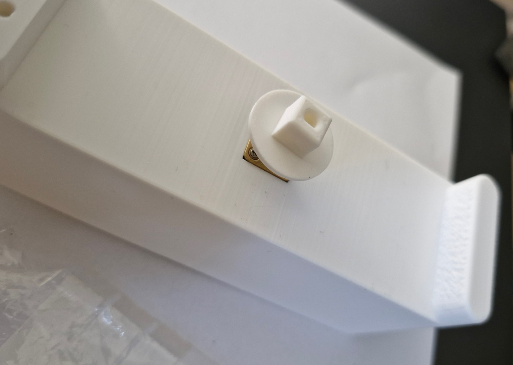

4. Connect internal wiring and screw controller board into place

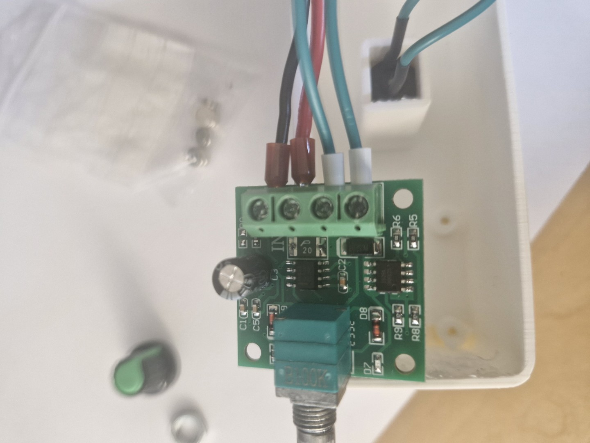
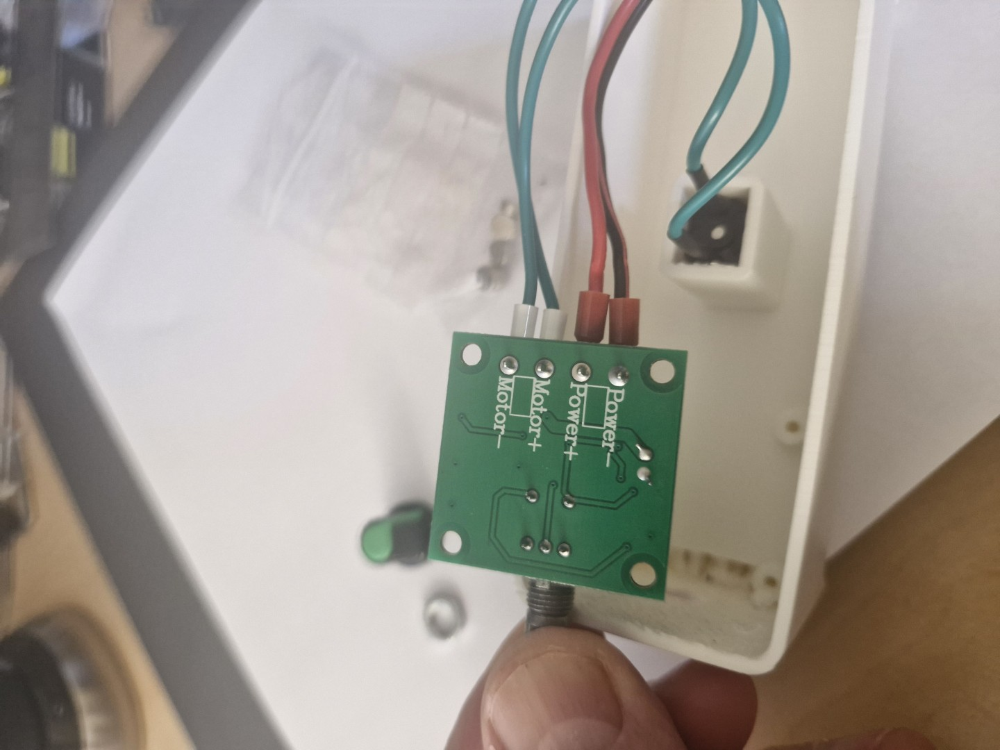
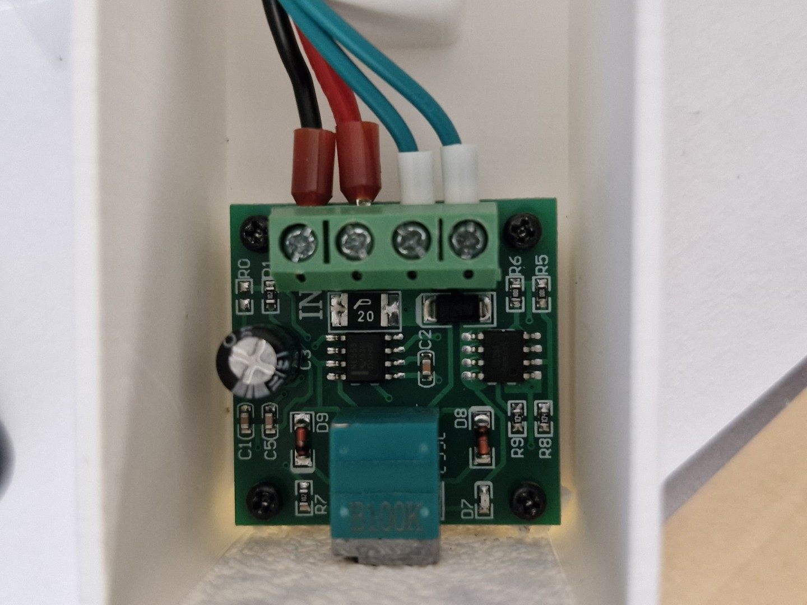

5. Check everything works and clip in the base

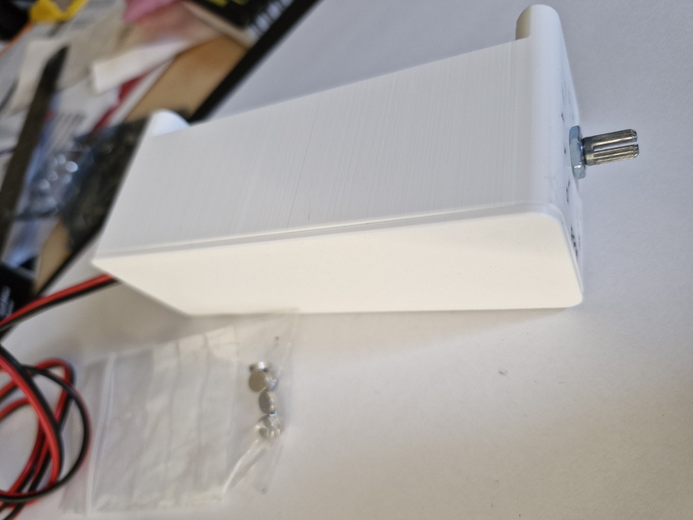

6. Insert magnets into rotor (keep polarity the same - marking dots helps)

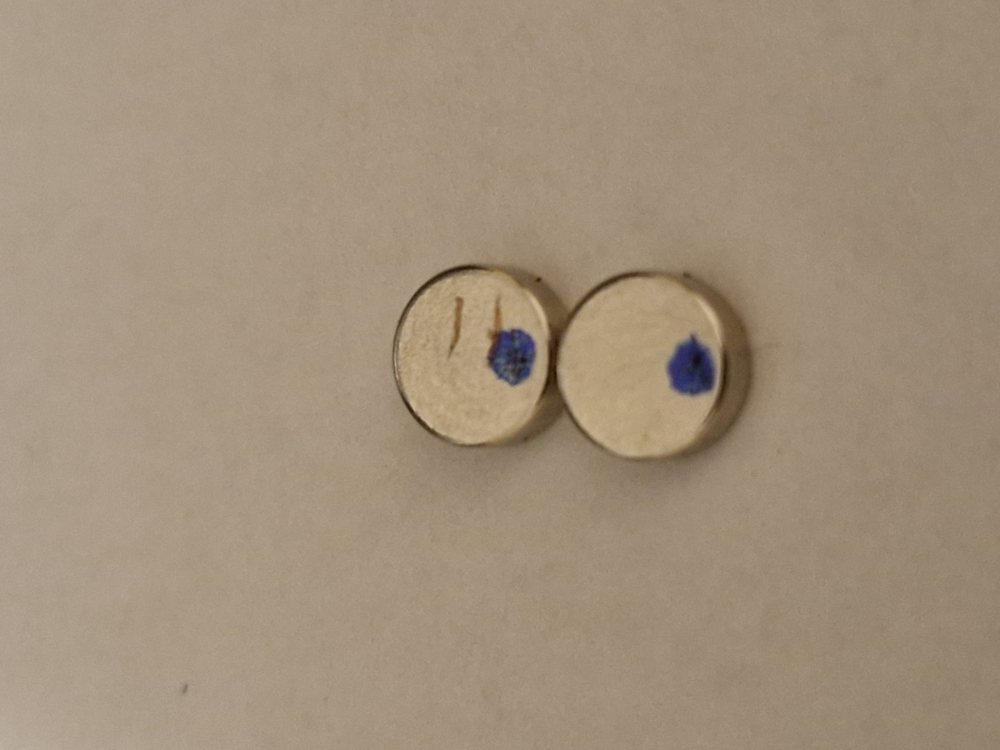

7. Mount rotor and control knob

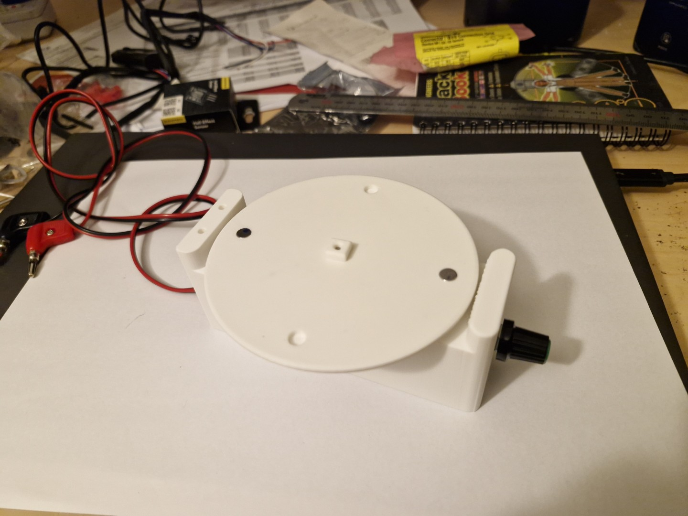