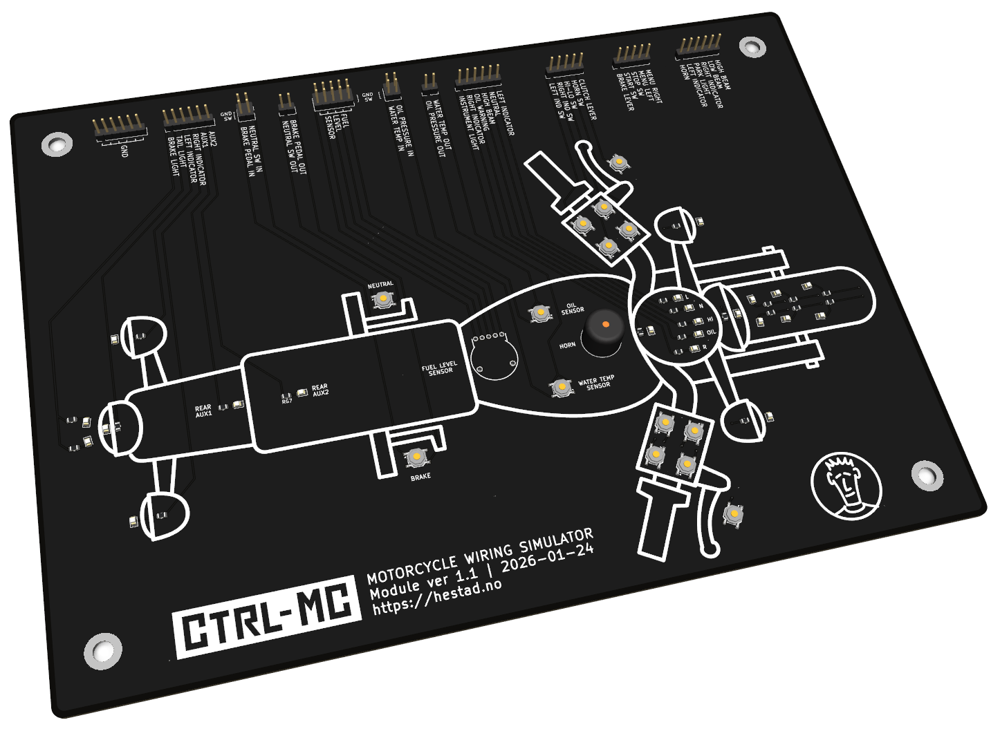

# Motorcycle Wiring Simulator

The Motorcycle Wiring Simulator is a PCB to be used for developing and testing motorcycle wiring solutions. The schematics and PCB layout can be found in the zipped file in this folder. It's an achived KiCad project (version 9.0.5).

Version 1.0 is shown in the video referenced below. The included file is however version 1.1 and it has some minor improvements:

* The resistors to limit the voltage for the LEDs are changed according to version 1.0. The new resisrors reduces and balances the brightness.
* The buzzer is changed to a 12V type instaed of a 5V type with 680 ohm resistor to limit the voltage. The buzzer is also included in the parts list for ordering from JLCPCB.
* The pin headers are moved to the edge of the PCB and the lables are moved to the other side of the pin headers to make it easier to read the labels when working with the module.
* The KiCad project includes part numbers for fabrication and assembly from JLCPCB. Pin headers are marked as excluded so they will by default not be added into the BOM- and placement file. Add part numbers and include them to BOM and placement file if you want JLCPCB to mount them for you.

Be aware that version 1.1 is not tested, if ordering a PCB based on this project remember to check it first.

Check the YouTube video "I Turned a Motorcycle Into a Circuit Board" for more info and for a demo of version 1.0:

* https://youtu.be/JKvbBq6Y1_M?si=p860frQD5cO-tTMq

Version 1.1 looks like this:

